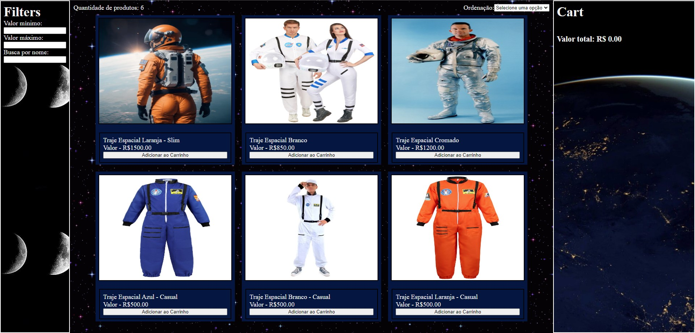

# Projeto Labecommerce

Projeto de desenvolvimento de um e-commerce de produtos espaciais, no meu caso, a escolhida foi pela comercialização de Roupas Espaciais, sendo possível realizar filtros, ordenações, adição e remoção dos produtos disponíveis.

## Índice
- <a href="#link-do-surge">Link do Surge do projeto</a>
- <a href="#funcionalidades-do-projeto">Funcionalidades do projeto</a>
- <a href="#layout-desktop">Layout desktop</a>
- <a href="#layout-mobile">Layout mobile</a>
- <a href="#como-rodar-este-projeto">Rodando o projeto</a>

## Link do Surge
https://labecommerce-lopm-projetolabenu.surge.sh/

## Funcionalidades do Projeto
- [X] Filtrar por Valor Mínimo
- [X] Filtrar por Valor Máximo
- [X] Busca por Nome
- [X] Ordenação por Nome: de A a Z ou de Z a A
- [X] Ordenação por Preço: Crescente ou Decrescente
- [X] Adicionar ao Carrinho
- [X] Remover do Carrinho
- [X] Visualizar as quantidades de cada produto no Carrinho
- [X] Visualizar o preço Total da compra

## Layout Desktop


## Layout Mobile


## Como rodar este projeto?
```bash
# Clone este repositório
$ git clone linkrepo

# Acesse a pasta do projeto no seu terminal
$ cd labecommerce

# Instale as dependências
$ npm install

# Execute a aplicação
$ npm run start

# A aplicação será iniciada na porta 3000, acesse pelo navegador: https://localhost:3000
```